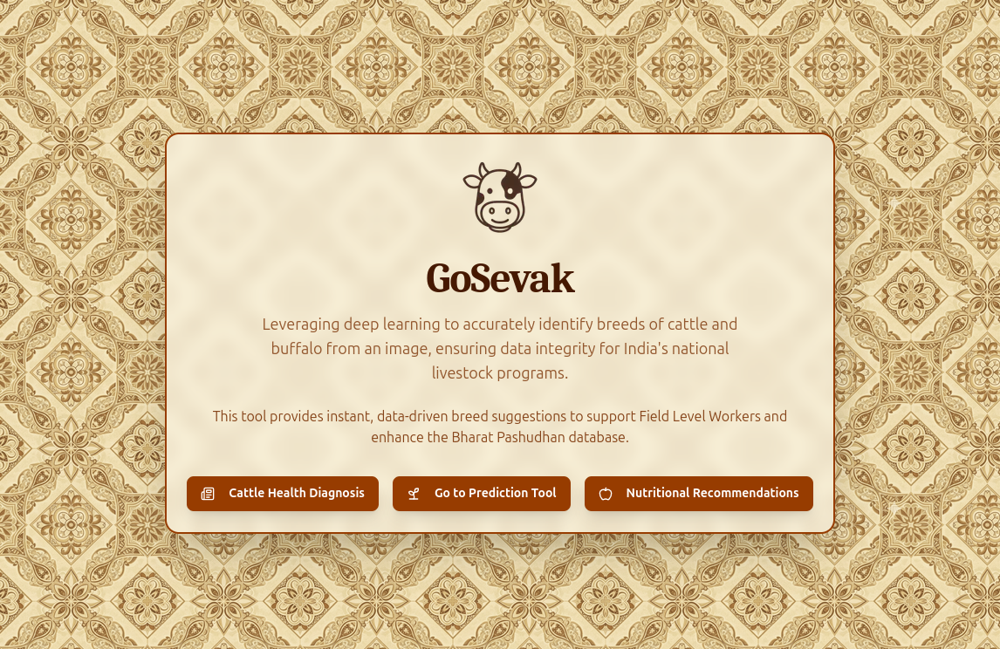

# Bovine Breeds Identification Web App



## A Web-Based AI Tool for Classifying Indian Bovine Breeds

### 🚀 Live Demo
- Experience the live application here: **[bovine-breeds-web.vercel.app](https://bovine-breeds-web.vercel.app/)**
- **Note:** The Inference API might take some time (2-5 minutes) to cold-start and give a response if left unused for a long time, so please beware of that.

### ✨ Features
- **AI-Powered Classification:** Upload an image and get an instant breed prediction from a trained deep learning model.
- **Responsive Design:** A clean, modern, and fully responsive user interface built with Tailwind CSS.
- **Drag & Drop Upload:** User-friendly interface for easy image selection.
- **Serverless Deployment:** Hosted on Vercel for fast, global access.
- **Direct Model Access:** Provides a release link for the trained `.pth` model for other developers to use.

### 📖 Table of Contents
1. [Overview](#-overview)
2. [Technology Stack](#-technology-stack)
3. [AI Model](#-ai-model)
4. [Disclaimer](#️-disclaimer)
5. [Installation](#️-installation)
6. [Contributors](#-contributors)
7. [License](#️-license)

### 🔍 Overview
This project serves as the original web-based platform for the GoSevak AI model. It was developed to provide an accessible and easy-to-use tool for identifying various Indian bovine breeds directly from a web browser. The application showcases the model's capabilities and provides a foundation for the offline-first mobile app.

Users can simply upload an image of a bovine, and the backend service (powered by the trained PyTorch model) returns the predicted breed along with a confidence score.

### 💻 Technology Stack
- **Framework:** Next.js
- **Language:** React, TypeScript
- **Styling:** Tailwind CSS
- **Deployment:** Vercel

### 🧠 AI Model
The core of this application is the deep learning model trained to classify 41 different Indian bovine breeds.

The full training process can be reviewed in the **[PTH Model Training Notebook](https://github.com/Priyanshu631/bovine-breeds/blob/main/apps/docs/indian-bovine-breeds-classification.ipynb)**.

**Key Insights:**
- **Model Architecture:** Utilizes a `convnext_tiny` model from the `timm` library, fine-tuned on the dataset using transfer learning.
- **Training:** Employs a two-phase training strategy (warmup and fine-tuning) with techniques like data augmentation, Mixup, and weighted sampling to handle class imbalance across 41 breeds.
- **Performance:** Achieved a validation accuracy of **~65%** on the public dataset.

- **Model Release:** The trained model weights are available for download as a `.pth` file from the official GitHub release.
  - **[Download the AI Model Release](https://github.com/Priyanshu631/bovine-breeds/releases)**

### ⚠️ Disclaimer
- The model was trained on a publicly available, non-curated dataset from Kaggle: **[Indian Bovine Breeds Dataset](https://www.kaggle.com/datasets/lukex9442/indian-bovine-breeds)**.
- Due to potential inconsistencies or incorrect labels within this public data, the model's accuracy, while robust, may not reflect the performance achievable with an officially curated and verified dataset. Performance can be significantly improved if curated data is provided by the responsible authorities.

### ⚙️ Installation
To run this project locally, follow these steps:

```bash
# Clone the repository
git clone https://github.com/Priyanshu631/bovine-breeds.git

# Navigate to the project directory
cd bovine-breeds

# Install dependencies
npm install

# Run the development server
npm run dev
```

### 📝 Contributors
- **[Priyanshu Ranjan](https://github.com/Priyanshu631)** 
- **[Rajveer Sanyal](https://github.com/rajveer0104)** 
- **[Aniket Nag](https://github.com/homelesssnake-101)** 
- **[Anurima Sarkar](https://github.com/Anurima2206)** 
- **[Rajdeep Podder](https://github.com/raj-deep-20)**
- **[Ritobrata Dutta](https://github.com/drito04)**

### ⚖️ License
- **Check The LICENSE File In The Repo For MIT License.**
